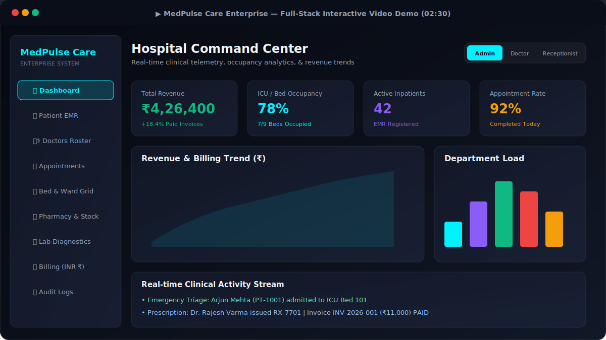
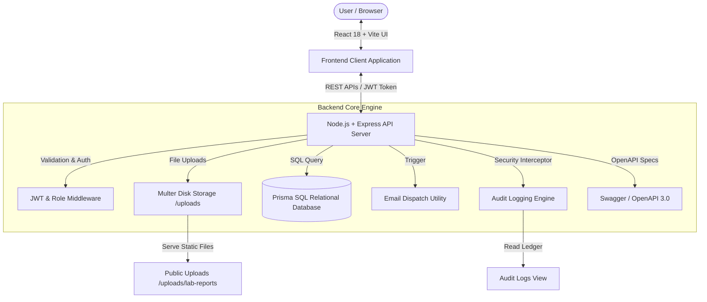

# MedPulse Enterprise Hospital Management System 🏥🇮🇳

<p align="center">
  
</p>

A production-ready, full-stack Hospital Management System built with **React 18**, **Vite**, **Node.js + Express REST APIs**, **Prisma ORM & SQL Relational Database Engine**, **JWT Authentication with Role-Based Access Control (RBAC)**, **Multer Medical File Uploads**, **System Audit Logging**, **Automated Email Dispatch**, **Recharts Clinical Telemetry**, **PDF Invoicing (INR ₹)**, **OpenAPI 3.0 Documentation**, and an **Automated Unit Test Suite**.

---

## 📽️ 2–3 Minute Demo Video Walkthrough Guide

Follow this structured flow when recording a demo video for recruiters or stakeholders (using Loom, OBS Studio, or Windows Game Bar `Win + G`):

| Time | Scene | Action / Features Highlighted |
|---|---|---|
| **0:00 - 0:35** | **Login & Role-Based Access (RBAC)** | Start at `http://localhost:5173/`. Click Admin, Doctor, and Receptionist quick-swapper buttons in the top navbar to demonstrate JWT session switching and role permissions. |
| **0:35 - 1:10** | **Executive Dashboard Telemetry** | Show the Command Center KPI cards (Occupancy %, Revenue in ₹, Active Inpatients), interactive Recharts Revenue trend curve, Department load bar graph, and real-time clinical stream. |
| **1:10 - 1:45** | **Patient EMR & Document Upload** | Navigate to **Patient EMR**. Open Arjun Mehta's profile to view vitals and history. Click **Upload** to attach a PDF lab report using **Multer**. Demonstrate server-side pagination controls. |
| **1:45 - 2:15** | **Appointment Booking & Bed Grid** | Navigate to **Appointments**, click **+ Book Appointment**, select doctor `Dr. Rajesh Varma`, date, and time slot. Check **Bed & Ward Grid** for ICU/Suite occupancy. |
| **2:15 - 2:45** | **Financial Billing & System Audit Logs** | Go to **Billing & Invoices**, click **+ Generate Invoice**, create an itemized bill, and click **PDF Invoice** to download the official receipt formatted in **Rs. (INR)**. Open **System Audit Logs** to show the security ledger. |
| **2:45 - 3:00** | **Architecture & API Documentation** | Open `http://localhost:5000/api-docs` to highlight the interactive OpenAPI 3.0 Swagger specifications. |

---

## 🏗️ System Architecture & Data Flow



---

## 🌟 Key Enterprise Features

1. **📁 Multer Medical File Upload System**:
   - Secure file storage (`/uploads`) with 10MB file size limits and MIME-type validation (`.pdf`, `.jpg`, `.png`, `.webp`).
   - Upload PDF lab diagnostic reports, X-rays, CT/MRI scan images, and patient profile photos.
   - Interactive Drag-and-Drop file picker & preview modal on EMR & Diagnostics pages.

2. **📜 System Audit & Security Logging Engine**:
   - Real-time security ledger (`audit_logs`) tracking `CREATE_PATIENT`, `BOOK_APPOINTMENT`, `ALLOCATE_BED`, `GENERATE_BILL`, and `FILE_UPLOADED` with timestamp, user role, and IP address.
   - Dedicated **System Audit Logs** UI page with search and action filters.

3. **📧 Automated Email Notifications**:
   - `backend/src/utils/mailer.js` handles formatted HTML email templates for appointment booking confirmations and pathology test report alerts.

4. **📱 Mobile & Tablet Responsive UI**:
   - Mobile navigation hamburger drawer toggle for screens `< 768px` and touch-friendly scrollable tables.

5. **🛡️ Input Validation & Centralized Error Handling**:
   - Express validation middleware (`validate.js`) for Indian phone numbers (+91 / 10-digit format) and required fields.
   - Centralized Express error handler (`errorHandler.js`) with standardized JSON error responses.

6. **🔍 Server-Side Pagination & Filtering**:
   - REST API pagination support (`page`, `limit`, `search`, `triageLevel`) and reusable `Pagination.jsx` component.

7. **📄 Swagger / OpenAPI 3.0 Documentation**:
   - Interactive OpenAPI 3.0 specification available live at `/api-docs`.

8. **🧪 Automated Backend Unit Test Suite**:
   - Automated unit test runner (`backend/tests/api.test.js`) executed via `npm test`.

9. **💰 Indian Rupee (₹) Financial Suite**:
   - Itemized billing generator with automatic total calculation, discount application, insurance claim status tracking, and downloadable PDF receipts (`jsPDF`).

10. **🚨 Emergency Triage & Dispatch Desk**:
    - Color-coded triage priority management (`RED`, `YELLOW`, `GREEN`) and mobile ambulance unit dispatch tracker.

---

## 🗄️ Relational Database Schema (SQL / Prisma)

```
[ User ] (id, email, password, name, role: ADMIN | DOCTOR | RECEPTIONIST)
   │
   ├──► [ Doctor ] (id, departmentId, specialization, licenseNumber, availability, onCall)
   │
[ Department ] ◄─── [ Doctor ]
   │
   └──► [ Patient ] (id, patientId, name, age, gender, bloodGroup, triageLevel, medicalHistory, avatarUrl)
           │
           ├──► [ Appointment ] (id, appointmentCode, doctorId, date, timeSlot, priority, status)
           ├──► [ Bed ] (id, bedNumber, wardType, status: OCCUPIED | AVAILABLE | CLEANING, patientId)
           ├──► [ Prescription ] (id, prescriptionId, doctorId, diagnosis, medicines)
           ├──► [ LabTest ] (id, testCode, testName, category, status, result, cost, reportFileUrl)
           └──► [ Bill ] (id, invoiceNumber, subtotal, discount, totalAmount, status: PAID | PENDING)

[ AuditLog ] (id, timestamp, userId, userName, userRole, action, entity, details, ipAddress)
```

---

## 🔌 Core REST API Endpoints

### Auth & Security
- `POST /api/auth/login` - Authenticate user credentials & issue JWT token.
- `GET /api/auth/me` - Fetch authenticated session & permissions.

### Clinical & Administrative
- `GET /api/patients` - List all EMR patients (Searchable, Filterable & Paginated).
- `POST /api/patients` - Register new patient (With +91 phone validation).
- `GET /api/patients/:id` - Detailed EMR profile (includes prescriptions, lab tests, bills).
- `GET /api/doctors` - Directory of specialists & departments.
- `GET /api/appointments` - Consultation queue.
- `POST /api/appointments` - Book appointment slot & trigger email notification.
- `GET /api/beds` - Visual ward grid status.
- `PATCH /api/beds/:id/status` - Allocate/Discharge bed.
- `GET /api/pharmacy` & `GET /api/lab-tests` - Diagnostics & prescription streams.
- `GET /api/billing` & `POST /api/billing` - Financial ledger & invoice generator.
- `GET /api/audit-logs` - Retrieve system security audit log ledger.
- `POST /api/upload/lab-report` - Upload PDF lab report or scan image (Multer).
- `GET /api/analytics` - Aggregated executive metrics & charts data.
- `GET /api-docs` - OpenAPI 3.0 Documentation specification.

---

## 🔑 Demo Login Accounts

| Role | Email | Password |
|---|---|---|
| **Admin** | `admin@hospital.com` | `admin123` |
| **Doctor** | `doctor@hospital.com` | `doctor123` |
| **Receptionist** | `reception@hospital.com` | `reception123` |

---

## 🚀 Quick Setup & Local Execution

### 1. Backend API Server
```bash
cd backend
npm install
npm run seed     # Populate database with initial Indian clinical demo data
npm test         # Execute automated API unit test suite
npm run dev      # Server starts on http://localhost:5000
```

### 2. Frontend Application
```bash
cd frontend
npm install
npm run dev      # React Vite app starts on http://localhost:5173
```

---

## 🧪 Running Unit Tests

Run the backend integration test suite:
```bash
cd backend
npm test
```
*Expected Output: 100% Passing tests across Auth, Patients, Audit Logs, and OpenAPI endpoints.*
